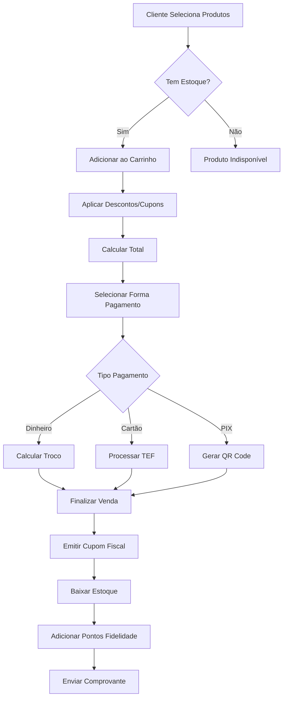
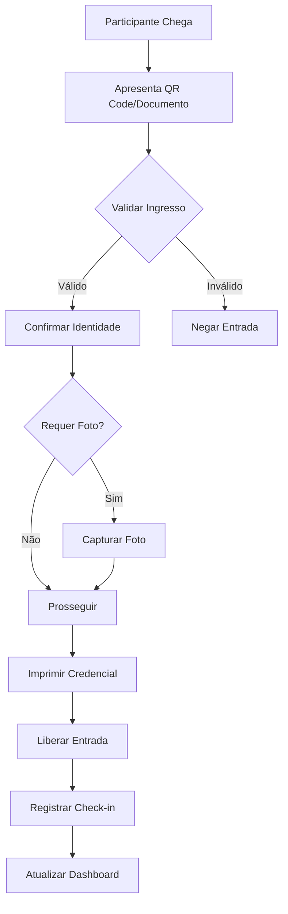
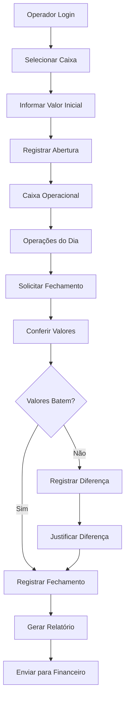

# MEEP - Engenharia Reversa Completa do Sistema

## Executive Summary

O MEEP é uma plataforma SaaS multi-tenant completa para gestão de eventos, que integra todos os aspectos operacionais, financeiros e de marketing em uma única solução. O sistema suporta eventos de pequeno a grande porte (100 a 50.000+ participantes) com funcionalidades avançadas de PDV, gestão de estoque, programa de fidelidade, BI e automações.

---

## 1. ARQUITETURA DO SISTEMA

### 1.1 Arquitetura Geral
```
┌─────────────────────────────────────────────────────────────────┐
│                         FRONTEND LAYER                           │
├───────────────┬──────────────┬──────────────┬──────────────────┤
│  Web App      │  Mobile App  │  PWA         │  Kiosk/Totem    │
│  (React)      │  (React Native) │ (Next.js) │  (Electron)     │
└───────────────┴──────────────┴──────────────┴──────────────────┘
                                │
                    ┌───────────┴───────────┐
                    │    API Gateway         │
                    │    (Kong/Nginx)        │
                    └───────────┬───────────┘
                                │
┌──────────────────────────────────────────────────────────────────┐
│                         BACKEND SERVICES                          │
├────────────┬────────────┬────────────┬────────────┬────────────┤
│  Auth      │  Core API  │  Payment   │  Analytics │  Realtime  │
│  Service   │  (Node.js) │  Service   │  Service   │  (Socket)  │
└────────────┴────────────┴────────────┴────────────┴────────────┘
                                │
┌──────────────────────────────────────────────────────────────────┐
│                         DATA LAYER                                │
├────────────┬────────────┬────────────┬────────────┬────────────┤
│ PostgreSQL │   Redis    │  MongoDB   │   S3/CDN   │ TimescaleDB│
│  (Main)    │  (Cache)   │  (Logs)    │  (Files)   │  (Metrics) │
└────────────┴────────────┴────────────┴────────────┴────────────┘
```

### 1.2 Stack Tecnológico

#### Frontend
- **Framework Principal**: React 18.2+ com TypeScript
- **State Management**: Redux Toolkit + RTK Query
- **UI Components**: Material-UI v5 / Ant Design Pro
- **Styling**: Styled Components + Tailwind CSS
- **Forms**: React Hook Form + Yup validation
- **Charts**: Recharts / ApexCharts
- **Real-time**: Socket.io Client
- **PWA**: Workbox + Service Workers

#### Backend
- **Runtime**: Node.js 18+ LTS
- **Framework**: Express.js / Fastify
- **ORM**: Sequelize / TypeORM
- **Authentication**: JWT + Refresh Tokens
- **API Documentation**: Swagger/OpenAPI 3.0
- **Queue**: Bull + Redis
- **WebSockets**: Socket.io
- **Email**: Nodemailer + SendGrid
- **SMS/WhatsApp**: Twilio API

#### Database & Storage
- **Primary DB**: PostgreSQL 14+
- **Cache**: Redis 7+
- **Search**: Elasticsearch 8+
- **File Storage**: AWS S3 / MinIO
- **CDN**: CloudFlare / CloudFront

#### Infrastructure
- **Container**: Docker + Docker Compose
- **Orchestration**: Kubernetes (K8s)
- **CI/CD**: GitLab CI / GitHub Actions
- **Monitoring**: Datadog / New Relic
- **Logging**: ELK Stack
- **APM**: Sentry

---

## 2. MÓDULOS DO SISTEMA

### 2.1 Dashboard Principal

#### Estrutura de Dados
```typescript
interface DashboardMetrics {
  id: string;
  evento_id: string;
  data: Date;
  
  // Vendas
  total_vendas: number;
  valor_vendas: number;
  ticket_medio: number;
  
  // Clientes
  total_clientes: number;
  novos_clientes: number;
  clientes_recorrentes: number;
  
  // Produtos
  produtos_vendidos: number;
  produtos_mais_vendidos: Product[];
  
  // Financeiro
  faturamento_bruto: number;
  faturamento_liquido: number;
  taxas: number;
  
  // Operacional
  checkins_realizados: number;
  tempo_medio_atendimento: number;
  filas_espera: number;
  
  // Estoque
  alertas_estoque: StockAlert[];
  produtos_fim_estoque: Product[];
}
```

#### APIs Principais
- `GET /api/dashboard/metrics` - Métricas gerais
- `GET /api/dashboard/sales-chart` - Gráfico de vendas
- `GET /api/dashboard/real-time` - Dados em tempo real (WebSocket)
- `GET /api/dashboard/kpis` - KPIs customizados

### 2.2 Gestão de Eventos

#### Estrutura de Dados
```typescript
interface Evento {
  id: string;
  empresa_id: string;
  
  // Informações Básicas
  nome: string;
  descricao: string;
  tipo: 'festival' | 'show' | 'conferencia' | 'feira' | 'corporativo';
  
  // Datas e Local
  data_inicio: Date;
  data_fim: Date;
  timezone: string;
  local: {
    nome: string;
    endereco: string;
    cidade: string;
    estado: string;
    cep: string;
    coordenadas: {
      lat: number;
      lng: number;
    };
  };
  
  // Capacidade
  capacidade_maxima: number;
  capacidade_atual: number;
  
  // Configurações
  configuracoes: {
    permite_meia_entrada: boolean;
    idade_minima: number;
    requer_documento: boolean;
    permite_cancelamento: boolean;
    prazo_cancelamento_horas: number;
    permite_transferencia: boolean;
  };
  
  // Financeiro
  configuracao_fiscal: {
    emite_nfe: boolean;
    cnpj_emissor: string;
    regime_tributario: string;
  };
  
  // Status
  status: 'rascunho' | 'publicado' | 'em_andamento' | 'finalizado' | 'cancelado';
  
  // Timestamps
  created_at: Date;
  updated_at: Date;
}
```

#### APIs
- `POST /api/eventos` - Criar evento
- `GET /api/eventos` - Listar eventos
- `GET /api/eventos/:id` - Detalhes do evento
- `PUT /api/eventos/:id` - Atualizar evento
- `DELETE /api/eventos/:id` - Excluir evento
- `POST /api/eventos/:id/publish` - Publicar evento
- `POST /api/eventos/:id/clone` - Clonar evento

### 2.3 PDV (Ponto de Venda)

#### Estrutura de Dados
```typescript
interface Venda {
  id: string;
  numero_venda: string;
  evento_id: string;
  caixa_id: string;
  vendedor_id: string;
  cliente_id?: string;
  
  // Itens
  itens: ItemVenda[];
  
  // Valores
  subtotal: number;
  desconto: number;
  acrescimo: number;
  total: number;
  
  // Pagamento
  forma_pagamento: {
    tipo: 'dinheiro' | 'cartao_credito' | 'cartao_debito' | 'pix' | 'voucher';
    parcelas?: number;
    bandeira?: string;
    nsu?: string;
    autorizacao?: string;
  }[];
  
  // Status
  status: 'pendente' | 'pago' | 'cancelado' | 'estornado';
  
  // Fiscal
  nfe?: {
    numero: string;
    serie: string;
    chave: string;
    protocolo: string;
    xml: string;
  };
  
  // Timestamps
  data_venda: Date;
  data_cancelamento?: Date;
}

interface ItemVenda {
  id: string;
  produto_id: string;
  produto_nome: string;
  quantidade: number;
  preco_unitario: number;
  desconto: number;
  total: number;
  observacoes?: string;
}
```

#### APIs
- `POST /api/pdv/venda` - Realizar venda
- `GET /api/pdv/produtos` - Listar produtos disponíveis
- `POST /api/pdv/venda/:id/cancelar` - Cancelar venda
- `POST /api/pdv/venda/:id/estornar` - Estornar venda
- `GET /api/pdv/fechamento-caixa` - Fechamento de caixa
- `WebSocket: /api/pdv/ws` - Atualizações em tempo real

### 2.4 Gestão de Clientes

#### Estrutura de Dados
```typescript
interface Cliente {
  id: string;
  
  // Dados Pessoais
  cpf: string;
  nome: string;
  email: string;
  telefone: string;
  data_nascimento: Date;
  genero: 'M' | 'F' | 'O';
  
  // Endereço
  endereco: {
    cep: string;
    logradouro: string;
    numero: string;
    complemento?: string;
    bairro: string;
    cidade: string;
    estado: string;
  };
  
  // Marketing
  aceita_email: boolean;
  aceita_sms: boolean;
  aceita_whatsapp: boolean;
  
  // Fidelidade
  programa_fidelidade: {
    ativo: boolean;
    pontos: number;
    nivel: 'bronze' | 'prata' | 'ouro' | 'diamante';
    data_adesao: Date;
  };
  
  // Segmentação
  tags: string[];
  segmentos: string[];
  
  // Histórico
  primeira_compra: Date;
  ultima_compra: Date;
  total_gasto: number;
  ticket_medio: number;
  frequencia_compra: number;
  
  // RFM Score
  rfm: {
    recencia: number;
    frequencia: number;
    valor_monetario: number;
    score: string;
  };
}
```

#### APIs
- `POST /api/clientes` - Cadastrar cliente
- `GET /api/clientes` - Listar clientes
- `GET /api/clientes/:id` - Detalhes do cliente
- `PUT /api/clientes/:id` - Atualizar cliente
- `GET /api/clientes/:id/historico` - Histórico de compras
- `POST /api/clientes/importar` - Importação em massa
- `GET /api/clientes/exportar` - Exportação

### 2.5 Gestão de Estoque

#### Estrutura de Dados
```typescript
interface Estoque {
  id: string;
  produto_id: string;
  local_id: string;
  
  // Quantidades
  quantidade_atual: number;
  quantidade_minima: number;
  quantidade_maxima: number;
  quantidade_reservada: number;
  
  // Custos
  custo_medio: number;
  ultimo_custo: number;
  
  // Lote
  lote?: {
    numero: string;
    data_fabricacao: Date;
    data_validade: Date;
  };
  
  // Controle
  permite_negativo: boolean;
  controla_validade: boolean;
  
  // Alertas
  alertas: {
    estoque_minimo: boolean;
    validade_proxima: boolean;
  };
}

interface MovimentoEstoque {
  id: string;
  produto_id: string;
  tipo: 'entrada' | 'saida' | 'ajuste' | 'transferencia' | 'perda';
  quantidade: number;
  valor_unitario: number;
  
  // Origem/Destino
  origem: {
    tipo: 'fornecedor' | 'transferencia' | 'producao' | 'ajuste';
    id: string;
    local_id: string;
  };
  
  destino?: {
    tipo: 'venda' | 'transferencia' | 'perda';
    id: string;
    local_id: string;
  };
  
  // Documento
  documento: {
    tipo: 'nf' | 'cupom' | 'interno';
    numero: string;
  };
  
  responsavel_id: string;
  observacoes: string;
  data_movimento: Date;
}
```

#### APIs
- `GET /api/estoque` - Consultar estoque
- `POST /api/estoque/entrada` - Registrar entrada
- `POST /api/estoque/saida` - Registrar saída
- `POST /api/estoque/ajuste` - Ajuste de inventário
- `POST /api/estoque/transferencia` - Transferência entre locais
- `GET /api/estoque/movimentos` - Histórico de movimentos
- `GET /api/estoque/alertas` - Alertas de estoque

### 2.6 Check-in e Credenciamento

#### Estrutura de Dados
```typescript
interface Checkin {
  id: string;
  evento_id: string;
  participante_id: string;
  ingresso_id: string;
  
  // Dados do Check-in
  data_checkin: Date;
  local_checkin: string;
  metodo: 'qrcode' | 'manual' | 'facial' | 'documento';
  
  // Validação
  validacao: {
    documento_validado: boolean;
    foto_capturada: boolean;
    assinatura_capturada: boolean;
  };
  
  // Credencial
  credencial: {
    numero: string;
    tipo: 'pulseira' | 'cracha' | 'adesivo' | 'digital';
    impressa: boolean;
    data_impressao?: Date;
  };
  
  // Operador
  operador_id: string;
  terminal_id: string;
  
  // Status
  status: 'confirmado' | 'pendente' | 'cancelado';
}

interface Ingresso {
  id: string;
  evento_id: string;
  cliente_id: string;
  
  // Tipo
  tipo: 'inteira' | 'meia' | 'cortesia' | 'vip' | 'camarote';
  lote: string;
  setor?: string;
  assento?: string;
  
  // Valores
  valor_original: number;
  valor_pago: number;
  
  // QR Code
  qrcode: string;
  qrcode_url: string;
  
  // Validade
  valido_de: Date;
  valido_ate: Date;
  
  // Status
  status: 'ativo' | 'usado' | 'cancelado' | 'transferido';
  
  // Transferência
  transferencias?: {
    de: string;
    para: string;
    data: Date;
  }[];
}
```

#### APIs
- `POST /api/checkin/validar` - Validar ingresso
- `POST /api/checkin/confirmar` - Confirmar check-in
- `GET /api/checkin/lista` - Lista de presença
- `POST /api/checkin/credencial/imprimir` - Imprimir credencial
- `GET /api/checkin/estatisticas` - Estatísticas de check-in
- `WebSocket: /api/checkin/ws` - Check-in em tempo real

### 2.7 Sistema Financeiro

#### Estrutura de Dados
```typescript
interface TransacaoFinanceira {
  id: string;
  evento_id: string;
  
  // Tipo
  tipo: 'receita' | 'despesa' | 'transferencia';
  categoria: string;
  subcategoria: string;
  
  // Valores
  valor_bruto: number;
  taxas: {
    gateway: number;
    antecipacao: number;
    outras: number;
  };
  valor_liquido: number;
  
  // Pagamento
  meio_pagamento: {
    tipo: string;
    gateway: string;
    tid: string;
    nsu: string;
  };
  
  // Liquidação
  status_liquidacao: 'pendente' | 'processando' | 'liquidado' | 'cancelado';
  data_liquidacao_prevista: Date;
  data_liquidacao_efetiva?: Date;
  
  // Split
  split?: {
    regras: SplitRule[];
    execucoes: SplitExecution[];
  };
  
  // Timestamps
  created_at: Date;
  updated_at: Date;
}

interface SplitRule {
  id: string;
  beneficiario: {
    tipo: 'empresa' | 'fornecedor' | 'parceiro';
    id: string;
    conta_bancaria: ContaBancaria;
  };
  
  // Regra
  tipo_calculo: 'percentual' | 'valor_fixo';
  valor: number;
  
  // Condições
  condicoes?: {
    produto_id?: string;
    categoria?: string;
    min_valor?: number;
  };
  
  prioridade: number;
}

interface ContaDigital {
  id: string;
  empresa_id: string;
  
  // Saldo
  saldo_disponivel: number;
  saldo_bloqueado: number;
  saldo_total: number;
  
  // Limites
  limite_saque_diario: number;
  limite_transferencia: number;
  
  // Antecipação
  antecipacao: {
    disponivel: boolean;
    limite: number;
    taxa: number;
    prazo_dias: number;
  };
}
```

#### APIs
- `GET /api/financeiro/dashboard` - Dashboard financeiro
- `GET /api/financeiro/transacoes` - Listar transações
- `POST /api/financeiro/antecipacao` - Solicitar antecipação
- `GET /api/financeiro/extrato` - Extrato da conta
- `POST /api/financeiro/transferencia` - Realizar transferência
- `GET /api/financeiro/split/regras` - Regras de split
- `POST /api/financeiro/split/configurar` - Configurar split

### 2.8 Marketing e CRM

#### Estrutura de Dados
```typescript
interface CampanhaMarketing {
  id: string;
  nome: string;
  tipo: 'email' | 'sms' | 'whatsapp' | 'push' | 'multicanal';
  
  // Segmentação
  segmentacao: {
    filtros: {
      idade?: { min: number; max: number };
      genero?: string[];
      cidade?: string[];
      tags?: string[];
      rfm_score?: string[];
      ultima_compra?: { dias: number };
      valor_gasto?: { min: number; max: number };
    };
    
    lista_ids?: string[];
    total_contatos: number;
  };
  
  // Conteúdo
  conteudo: {
    assunto?: string;
    mensagem: string;
    template_id?: string;
    personalizacao: boolean;
    utm_params?: {
      source: string;
      medium: string;
      campaign: string;
    };
  };
  
  // Agendamento
  agendamento: {
    tipo: 'imediato' | 'agendado' | 'recorrente';
    data_envio?: Date;
    recorrencia?: {
      frequencia: 'diario' | 'semanal' | 'mensal';
      dias?: number[];
    };
  };
  
  // Resultados
  resultados?: {
    enviados: number;
    entregues: number;
    abertos: number;
    cliques: number;
    conversoes: number;
    receita_gerada: number;
  };
  
  status: 'rascunho' | 'agendado' | 'enviando' | 'enviado' | 'pausado' | 'cancelado';
}

interface ProgramaFidelidade {
  id: string;
  nome: string;
  
  // Níveis
  niveis: {
    nome: string;
    pontos_necessarios: number;
    beneficios: string[];
    multiplicador_pontos: number;
  }[];
  
  // Regras de Pontuação
  regras_pontuacao: {
    valor_gasto_para_ponto: number;
    pontos_por_indicacao: number;
    pontos_aniversario: number;
    pontos_primeira_compra: number;
  };
  
  // Resgate
  opcoes_resgate: {
    tipo: 'desconto' | 'produto' | 'experiencia';
    pontos_necessarios: number;
    valor: number;
    descricao: string;
  }[];
  
  // Validade
  validade_pontos_dias: number;
}
```

#### APIs
- `POST /api/marketing/campanhas` - Criar campanha
- `GET /api/marketing/campanhas/:id/relatorio` - Relatório da campanha
- `POST /api/marketing/segmentos` - Criar segmento
- `GET /api/marketing/templates` - Templates de email
- `POST /api/fidelidade/pontos/adicionar` - Adicionar pontos
- `POST /api/fidelidade/pontos/resgatar` - Resgatar pontos
- `GET /api/fidelidade/extrato/:cliente_id` - Extrato de pontos

### 2.9 Business Intelligence (BI)

#### Estrutura de Dados
```typescript
interface DashboardBI {
  id: string;
  nome: string;
  tipo: 'vendas' | 'financeiro' | 'operacional' | 'marketing' | 'custom';
  
  // Widgets
  widgets: {
    id: string;
    tipo: 'metrica' | 'grafico' | 'tabela' | 'mapa';
    
    configuracao: {
      titulo: string;
      metricas: string[];
      dimensoes: string[];
      filtros: any;
      periodo: {
        tipo: 'fixo' | 'relativo';
        inicio?: Date;
        fim?: Date;
        ultimos_dias?: number;
      };
    };
    
    posicao: {
      x: number;
      y: number;
      largura: number;
      altura: number;
    };
  }[];
  
  // Permissões
  permissoes: {
    publico: boolean;
    usuarios: string[];
    grupos: string[];
  };
}

interface RelatorioAnalytics {
  id: string;
  
  // Métricas de Vendas
  vendas: {
    total: number;
    quantidade: number;
    ticket_medio: number;
    crescimento_percentual: number;
    
    por_periodo: {
      data: Date;
      valor: number;
    }[];
    
    por_produto: {
      produto: string;
      quantidade: number;
      valor: number;
    }[];
    
    por_categoria: {
      categoria: string;
      valor: number;
      percentual: number;
    }[];
  };
  
  // Métricas de Clientes
  clientes: {
    total: number;
    novos: number;
    recorrentes: number;
    churn_rate: number;
    ltv_medio: number;
    
    por_segmento: {
      segmento: string;
      quantidade: number;
      valor_total: number;
    }[];
  };
  
  // Análise de Comportamento
  comportamento: {
    horarios_pico: {
      hora: number;
      vendas: number;
    }[];
    
    dias_semana: {
      dia: string;
      vendas: number;
    }[];
    
    sazonalidade: {
      mes: string;
      vendas: number;
      crescimento: number;
    }[];
  };
  
  // Funil de Conversão
  funil: {
    visitantes: number;
    interessados: number;
    compradores: number;
    taxa_conversao: number;
  };
}
```

#### APIs
- `GET /api/bi/dashboards` - Listar dashboards
- `POST /api/bi/dashboards` - Criar dashboard
- `GET /api/bi/metricas` - Métricas disponíveis
- `POST /api/bi/relatorio/gerar` - Gerar relatório
- `GET /api/bi/analise/vendas` - Análise de vendas
- `GET /api/bi/analise/comportamento` - Análise comportamental
- `POST /api/bi/exportar` - Exportar dados

### 2.10 Gestão de Equipamentos

#### Estrutura de Dados
```typescript
interface Equipamento {
  id: string;
  tipo: 'impressora' | 'leitor_qr' | 'pos' | 'balanca' | 'display';
  
  // Identificação
  nome: string;
  modelo: string;
  fabricante: string;
  numero_serie: string;
  
  // Conexão
  conexao: {
    tipo: 'usb' | 'bluetooth' | 'wifi' | 'ethernet';
    endereco: string; // IP, MAC, etc
    porta?: number;
    configuracoes: any;
  };
  
  // Status
  status: {
    online: boolean;
    ultima_comunicacao: Date;
    bateria?: number;
    papel?: number; // Para impressoras
    erros?: string[];
  };
  
  // Localização
  local: {
    evento_id: string;
    setor: string;
    posicao: string;
  };
  
  // Configurações
  configuracoes: {
    auto_reconectar: boolean;
    timeout_segundos: number;
    formato_impressao?: string;
  };
}
```

### 2.11 Sistema de Pedidos (KDS - Kitchen Display System)

#### Estrutura de Dados
```typescript
interface Pedido {
  id: string;
  numero: string;
  tipo: 'balcao' | 'mesa' | 'delivery' | 'retirada';
  
  // Cliente
  cliente: {
    id?: string;
    nome: string;
    mesa?: string;
    telefone?: string;
  };
  
  // Itens
  itens: {
    id: string;
    produto_id: string;
    produto_nome: string;
    quantidade: number;
    observacoes?: string;
    
    // Preparação
    status: 'pendente' | 'preparando' | 'pronto' | 'entregue' | 'cancelado';
    setor_preparo: string;
    tempo_preparo_estimado: number;
    inicio_preparo?: Date;
    fim_preparo?: Date;
  }[];
  
  // Tempos
  tempo_total_estimado: number;
  data_pedido: Date;
  data_inicio_preparo?: Date;
  data_pronto?: Date;
  data_entrega?: Date;
  
  // Status
  status: 'recebido' | 'preparando' | 'pronto' | 'entregue' | 'cancelado';
  prioridade: 'normal' | 'alta' | 'urgente';
  
  // Pagamento
  pagamento_status: 'pendente' | 'pago';
  valor_total: number;
}
```

---

## 3. FLUXOS DE TRABALHO (WORKFLOWS)

### 3.1 Fluxo de Venda Completo



### 3.2 Fluxo de Check-in



### 3.3 Fluxo de Abertura/Fechamento de Caixa



---

## 4. REGRAS DE NEGÓCIO

### 4.1 Vendas e Pagamentos
1. **Estoque Negativo**: Não permitir venda de produtos sem estoque disponível
2. **Limite de Desconto**: Máximo 30% sem autorização superior
3. **Cancelamento**: Apenas supervisor pode cancelar venda após 30 minutos
4. **Split de Pagamento**: Máximo 3 formas de pagamento por venda
5. **Comissão**: Calculada automaticamente baseada em regras pré-definidas

### 4.2 Fidelidade
1. **Acúmulo de Pontos**: R$ 1,00 = 1 ponto (configurável)
2. **Validade**: Pontos expiram em 365 dias
3. **Resgate Mínimo**: 100 pontos
4. **Transferência**: Não permitida entre contas
5. **Níveis**: Bronze (0), Prata (1000), Ouro (5000), Diamante (10000)

### 4.3 Financeiro
1. **Antecipação**: Taxa de 2.5% a.m., prazo mínimo D+2
2. **Split Automático**: Aplicado em tempo real na transação
3. **Taxas Gateway**: Descontadas automaticamente do valor bruto
4. **Conciliação**: Diária às 6h00 AM
5. **Estorno**: Prazo máximo 90 dias

### 4.4 Check-in
1. **Validação Única**: QR Code usado apenas uma vez
2. **Timeframe**: Entrada permitida 2h antes do início
3. **Documento**: Obrigatório para meia-entrada
4. **Foto**: Capturada para eventos com > 5000 pessoas
5. **Credencial**: Impressão obrigatória para multi-dias

---

## 5. INTEGRAÇÕES

### 5.1 Gateways de Pagamento

#### PagSeguro
```javascript
// Configuração
{
  email: "empresa@email.com",
  token: "XXXXXX",
  sandbox: false,
  split: {
    enabled: true,
    receivers: [
      {
        publicKey: "PUB_KEY",
        percentage: 10.0
      }
    ]
  }
}

// Endpoints
POST /v2/transactions
GET /v3/transactions/{code}
POST /v2/transactions/refunds
```

#### Stripe
```javascript
// Configuração
{
  publishableKey: "pk_live_xxx",
  secretKey: "sk_live_xxx",
  webhookSecret: "whsec_xxx",
  connectAccount: "acct_xxx"
}

// Endpoints
POST /v1/payment_intents
POST /v1/refunds
POST /v1/transfers
```

### 5.2 Comunicação

#### WhatsApp Business API
```javascript
// Configuração
{
  phoneNumberId: "XXXXX",
  accessToken: "XXXXX",
  webhookUrl: "https://api.meep.com.br/webhook/whatsapp"
}

// Templates
- Confirmação de compra
- Ingresso digital
- Lembrete de evento
- Pesquisa de satisfação
```

#### SendGrid (Email)
```javascript
// Configuração
{
  apiKey: "SG.xxxxx",
  templates: {
    purchase_confirmation: "d-xxxxx",
    ticket: "d-xxxxx",
    reminder: "d-xxxxx"
  }
}
```

### 5.3 Fiscal

#### NFe/NFCe
```javascript
// Configuração
{
  ambiente: "producao", // ou "homologacao"
  certificado: "base64_string",
  senha: "xxxxx",
  csc: "xxxxx",
  idCsc: "1"
}

// Processo
1. Gerar XML
2. Assinar digitalmente
3. Enviar para SEFAZ
4. Aguardar autorização
5. Armazenar DANFE
```

### 5.4 Hardware

#### Impressoras Térmicas
- **Modelos Suportados**: Epson TM-T20, Bematech MP-4200, Elgin i9
- **Protocolo**: ESC/POS
- **Conexão**: USB, Ethernet, Bluetooth

#### Leitores QR Code
- **Modelos**: Datalogic, Honeywell, Zebra
- **Modos**: HID Keyboard, Serial COM

#### Balanças
- **Protocolo**: Toledo Prix 3/4/5
- **Comunicação**: Serial RS-232

---

## 6. SEGURANÇA E COMPLIANCE

### 6.1 Autenticação e Autorização

```typescript
interface AuthSystem {
  // JWT Token Structure
  token: {
    header: {
      alg: "RS256",
      typ: "JWT"
    },
    payload: {
      sub: string, // user_id
      empresa_id: string,
      evento_id?: string,
      roles: string[],
      permissions: string[],
      iat: number,
      exp: number
    }
  },
  
  // Refresh Token
  refreshToken: {
    token: string,
    expiresIn: 604800, // 7 dias
    family: string // Para detecção de reuso
  },
  
  // MFA
  mfa: {
    required: boolean,
    method: 'totp' | 'sms' | 'email',
    backupCodes: string[]
  }
}
```

### 6.2 LGPD Compliance

1. **Consentimento**: Registro de todos os consentimentos
2. **Portabilidade**: Export de dados em JSON/CSV
3. **Esquecimento**: Anonimização após solicitação
4. **Acesso**: Portal self-service para dados pessoais
5. **Auditoria**: Log de todos os acessos a dados sensíveis

### 6.3 PCI-DSS

1. **Tokenização**: Cartões tokenizados no gateway
2. **Não Armazenamento**: CVV nunca armazenado
3. **Criptografia**: TLS 1.3 em todas as comunicações
4. **Segmentação**: Rede isolada para pagamentos
5. **Monitoramento**: Alertas de transações suspeitas

---

## 7. PERFORMANCE E ESCALABILIDADE

### 7.1 Métricas de Performance

```yaml
SLA Targets:
  - API Response Time: < 200ms (p95)
  - Dashboard Load: < 2s
  - Check-in Processing: < 500ms
  - Payment Processing: < 3s
  - Report Generation: < 10s
  
Capacity:
  - Concurrent Users: 10,000+
  - Transactions/sec: 1,000+
  - Check-ins/min: 100+
  - Database Size: 1TB+
  
Availability:
  - Uptime: 99.9%
  - RTO: 1 hour
  - RPO: 15 minutes
```

### 7.2 Estratégias de Otimização

1. **Cache Multi-camada**
   - CDN: Assets estáticos
   - Redis: Sessões e dados quentes
   - Application: Query results
   - Database: Query cache

2. **Database Optimization**
   - Particionamento por tenant
   - Índices compostos
   - Materialized views para relatórios
   - Read replicas para consultas

3. **Async Processing**
   - Queue para emails/SMS
   - Batch processing noturno
   - Event-driven architecture
   - WebSockets para real-time

---

## 8. DEPLOYMENT E INFRAESTRUTURA

### 8.1 Arquitetura de Deploy

```yaml
Production Environment:
  Cloud: AWS
  Region: sa-east-1 (São Paulo)
  
  Compute:
    - ECS Fargate: API Services
    - Lambda: Background jobs
    - EC2: Legacy services
  
  Storage:
    - RDS PostgreSQL: Main database
    - ElastiCache Redis: Cache
    - S3: Files and backups
    - CloudFront: CDN
  
  Network:
    - VPC: 10.0.0.0/16
    - Subnets: Public/Private per AZ
    - ALB: Load balancing
    - WAF: Security
  
  Monitoring:
    - CloudWatch: Metrics
    - X-Ray: Tracing
    - GuardDuty: Threat detection
```

### 8.2 CI/CD Pipeline

```yaml
Pipeline Stages:
  1. Source:
     - Git push to main/develop
     - Webhook trigger
  
  2. Build:
     - Run tests
     - Build Docker images
     - Security scanning
  
  3. Test:
     - Unit tests
     - Integration tests
     - E2E tests
     - Performance tests
  
  4. Deploy Staging:
     - Blue-green deployment
     - Smoke tests
     - Manual approval
  
  5. Deploy Production:
     - Rolling update
     - Health checks
     - Auto-rollback on failure
  
  6. Post-Deploy:
     - Monitoring alerts
     - Performance validation
     - Backup verification
```

---

## 9. DOCUMENTAÇÃO DE APIS

### 9.1 Padrões REST

```yaml
URL Structure:
  Base: https://api.meep.com.br/v2
  Format: /resource/{id}/sub-resource
  
Methods:
  GET: Read
  POST: Create
  PUT: Full update
  PATCH: Partial update
  DELETE: Remove
  
Headers:
  Authorization: Bearer {token}
  X-API-Version: 2.0
  X-Tenant-ID: {empresa_id}
  X-Request-ID: {uuid}
  
Status Codes:
  200: Success
  201: Created
  204: No Content
  400: Bad Request
  401: Unauthorized
  403: Forbidden
  404: Not Found
  409: Conflict
  422: Validation Error
  429: Rate Limited
  500: Server Error
  
Pagination:
  ?page=1&limit=50
  ?cursor=xxx&limit=50
  
Filtering:
  ?status=active
  ?created_at[gte]=2024-01-01
  
Sorting:
  ?sort=created_at:desc
  ?sort=name:asc,created_at:desc
```

### 9.2 GraphQL Schema

```graphql
type Query {
  # Eventos
  evento(id: ID!): Evento
  eventos(filter: EventoFilter, pagination: Pagination): EventoConnection!
  
  # Vendas
  venda(id: ID!): Venda
  vendas(filter: VendaFilter, pagination: Pagination): VendaConnection!
  
  # Dashboard
  dashboardMetrics(eventoId: ID!, period: Period!): DashboardMetrics!
  
  # Relatórios
  relatorioVendas(filter: RelatorioFilter!): RelatorioVendas!
}

type Mutation {
  # Eventos
  createEvento(input: CreateEventoInput!): Evento!
  updateEvento(id: ID!, input: UpdateEventoInput!): Evento!
  
  # Vendas
  createVenda(input: CreateVendaInput!): Venda!
  cancelVenda(id: ID!, motivo: String!): Venda!
  
  # Check-in
  realizarCheckin(ingressoId: ID!): Checkin!
}

type Subscription {
  # Real-time updates
  vendaRealizada(eventoId: ID!): Venda!
  checkinRealizado(eventoId: ID!): Checkin!
  estoqueAtualizado(produtoId: ID!): Estoque!
}
```

---

## 10. CONCLUSÃO E ROADMAP

### 10.1 Features Implementadas
✅ Gestão completa de eventos
✅ PDV com múltiplas formas de pagamento
✅ Check-in e credenciamento
✅ Gestão de estoque multi-local
✅ Programa de fidelidade
✅ Dashboard e BI
✅ Sistema financeiro com split
✅ Marketing automation
✅ Integração fiscal
✅ Mobile apps

### 10.2 Roadmap Futuro
🔄 IA para previsão de demanda
🔄 Reconhecimento facial no check-in
🔄 Blockchain para ingressos
🔄 AR para navegação no evento
🔄 Voice commerce
🔄 IoT para monitoramento
🔄 Machine Learning para pricing
🔄 Metaverso integration

### 10.3 Estimativa de Implementação

Para replicar o sistema completo:

- **Time Necessário**: 8-10 desenvolvedores
- **Prazo**: 12-18 meses
- **Tecnologias Core**: Node.js, React, PostgreSQL, Redis
- **Investimento Inicial**: R$ 800k - 1.2M
- **Custo Mensal Infra**: R$ 15-25k (1000 eventos ativos)

---

## ANEXOS

### A. Estrutura de Diretórios Sugerida

```
meep-clone/
├── backend/
│   ├── src/
│   │   ├── modules/
│   │   │   ├── auth/
│   │   │   ├── eventos/
│   │   │   ├── vendas/
│   │   │   ├── estoque/
│   │   │   ├── financeiro/
│   │   │   ├── checkin/
│   │   │   ├── marketing/
│   │   │   └── bi/
│   │   ├── shared/
│   │   ├── config/
│   │   └── migrations/
│   └── tests/
├── frontend/
│   ├── src/
│   │   ├── components/
│   │   ├── pages/
│   │   ├── hooks/
│   │   ├── services/
│   │   └── utils/
│   └── public/
├── mobile/
├── docs/
└── infrastructure/
```

### B. Dependências Principais

```json
{
  "backend": {
    "express": "^4.18.0",
    "sequelize": "^6.35.0",
    "jsonwebtoken": "^9.0.0",
    "bcrypt": "^5.1.0",
    "socket.io": "^4.6.0",
    "bull": "^4.11.0",
    "nodemailer": "^6.9.0",
    "stripe": "^14.0.0",
    "swagger-ui-express": "^5.0.0"
  },
  "frontend": {
    "react": "^18.2.0",
    "redux-toolkit": "^2.0.0",
    "mui/material": "^5.14.0",
    "axios": "^1.6.0",
    "react-hook-form": "^7.48.0",
    "recharts": "^2.10.0",
    "socket.io-client": "^4.6.0"
  }
}
```

---

**Documento gerado através de análise e engenharia reversa do sistema MEEP**
**Data: Janeiro 2025**
**Versão: 1.0**